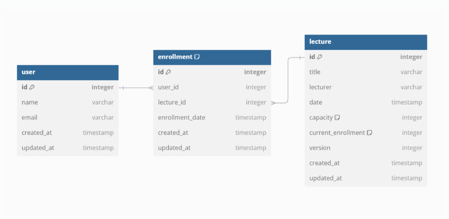

# lecture-registration-system
hhplus w2: TTD&amp;Clean architecture


## 특강 신청 시스템 ERD 설계
ERD 구조
```
erDiagram
    User ||--o{ Enrollment : has
    Lecture ||--o{ Enrollment : has
    
    User {
        integer id PK
        varchar name
        varchar email
        timestamp created_at
        timestamp updated_at
    }
    
    Enrollment {
        integer id PK
        integer user_id FK
        integer lecture_id FK
        timestamp enrollment_date
        timestamp created_at
        timestamp updated_at
    }
    
    Lecture {
        integer id PK
        varchar title
        varchar lecturer
        timestamp date
        integer capacity
        integer current_enrollment
        integer version
        timestamp created_at
        timestamp updated_at
    }
    
```
## 테이블 설계 설명
### User 테이블
사용자 기본 정보 관리
- id: 사용자 식별을 위한 기본키
- name, email: 사용자 기본 정보
- created_at, updated_at: 데이터 생성/수정 시간 추적
- Lecture 테이블

특강 정보 관리
- id: 특강 식별을 위한 기본키
- title, lecturer: 특강 기본 정보
- date: 특강 일시
- capacity: 최대 수강 인원 (기본값: 30)
- current_enrollment: 현재 등록된 수강생 수
- version: 동시성 제어를 위한 버전 관리
- created_at, updated_at: 데이터 생성/수정 시간 추적
- Enrollment 테이블

특강 신청 정보 관리
- id: 신청 내역 식별을 위한 기본키
- user_id: 신청한 사용자 참조 (외래키)
- lecture_id: 신청한 특강 참조 (외래키)
- enrollment_date: 실제 신청 일시
- created_at, updated_at: 데이터 생성/수정 시간 추적

설계 특징
1. 동시성 제어
- Lecture 테이블의 version 컬럼을 통한 낙관적 락 구현
-current_enrollment를 통한 수강 인원 제한 관리
2. 관계 설정
- User와 Lecture는 Enrollment를 통한 다대다 관계
- Enrollment 테이블이 중간 테이블 역할
3. 데이터 추적
- 모든 테이블에 created_at, updated_at 추가로 데이터 변경 이력 관리
4. 제약조건
- capacity와 current_enrollment로 수강 인원 제한
- Enrollment의 (user_id, lecture_id) 조합으로 중복 신청 방지

이 ERD 구조는 특강 신청 시스템의 핵심 요구사항인 수강 인원 제한과 중복 신청 방지를 효과적으로 지원합니다.
